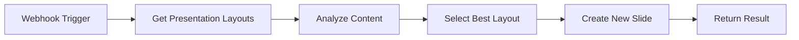

# 🔧  Google Slides API Automation [NOT FOR PRODUCTION USE]

A comprehensive system for dynamically generating Google Slides presentations through n8n workflows, featuring intelligent layout detection and content placement.

## 🎯 Features

- **Smart Layout Detection**: Automatically extracts and analyzes slide layouts from existing presentations
- **Intelligent Content Matching**: AI-powered layout selection based on content type
- **n8n Optimized**: Designed specifically for n8n Function and HTTP Request nodes
- **OAuth2 Authentication**: Seamless integration with n8n's Google OAuth2 credentials
- **Batch Operations**: Efficient slide creation and content insertion
- **Error Handling**: Robust error management for production workflows

## 🚀 Quick Start

### Prerequisites

1. **Google Cloud Setup**:
   - Enable Google Slides API in your Google Cloud project
   - Configure OAuth2 credentials or Service Account

2. **n8n Setup**:
   - Configure Google OAuth2 API credentials in n8n
   - Import the provided workflow templates

### Basic Workflow



## 📁 File Structure

```
├── README.md
├── src/
│   ├── core/
│   │   ├── slides-client.js          # Main client for Google Slides API
│   │   ├── layout-analyzer.js        # Layout detection and analysis
│   │   ├── content-matcher.js        # Intelligent layout selection
│   │   └── auth-handler.js           # Authentication utilities
│   ├── n8n-functions/
│   │   ├── get-layouts.js            # Extract presentation layouts
│   │   ├── match-layout.js           # Select best layout for content
│   │   ├── create-slide.js           # Create and populate slides
│   │   └── complete-workflow.js      # All-in-one function
│   └── workflows/
│       ├── basic-slide-creation.json # n8n workflow template
│       └── batch-processing.json     # Batch slide generation
├── examples/
│   ├── sample-inputs.json
│   └── sample-outputs.json
└── docs/
    ├── api-reference.md
    ├── n8n-setup.md
    └── troubleshooting.md
```

## 📖 Usage Examples

### Input JSON (from n8n webhook)

```json
{
  "deckId": "1a2B3cDEfgHIjkLmnopQRsTuVWxyz",
  "content": {
    "title": "Our 2025 Strategy",
    "body": "We will focus on community impact, sustainability, and operational excellence.",
    "imageUrl": "https://example.com/strategy-image.jpg",
    "bullets": [
      "Community Impact",
      "Sustainability",
      "Operational Excellence"
    ]
  }
}
```

### Output JSON

```json
{
  "success": true,
  "slideId": "g2a3b4c5d6e7f8g9h0",
  "slideUrl": "https://docs.google.com/presentation/d/1a2B3cDEfgHIjkLmnopQRsTuVWxyz/edit#slide=id.g2a3b4c5d6e7f8g9h0",
  "layoutUsed": "TITLE_AND_BODY",
  "elementsCreated": [
    {"type": "title", "objectId": "title_1"},
    {"type": "body", "objectId": "body_1"},
    {"type": "image", "objectId": "image_1"}
  ]
}
```

## 🔧 n8n Integration

### Method 1: Function Nodes (Recommended)

Paste the code from `src/n8n-functions/` directly into n8n Function nodes.

### Method 2: HTTP Request Nodes

Use the provided external service endpoints for complex operations.

### Method 3: Complete Workflow

Import the pre-built n8n workflow from `workflows/basic-slide-creation.json`.

## 🎨 Layout Selection Strategy

The system uses intelligent heuristics to match content with appropriate layouts:

- **Title + Body**: `TITLE_AND_BODY`, `TITLE_AND_TWO_COLUMNS`
- **Image Heavy**: `TITLE_ONLY`, `BLANK`
- **Lists/Bullets**: `TITLE_AND_BODY`, `SECTION_HEADER`
- **Quotes**: `SECTION_HEADER`, `TITLE_ONLY`
- **Comparisons**: `TITLE_AND_TWO_COLUMNS`, `FOUR_COLUMNS`

## 📚 Documentation

- [API Reference](docs/api-reference.md)
- [n8n Setup Guide](docs/n8n-setup.md)
- [Troubleshooting](docs/troubleshooting.md)

## 🤝 Contributing

Contributions are welcome! Please read our contributing guidelines and submit pull requests.

## 📄 License

MIT License - see LICENSE file for details.
